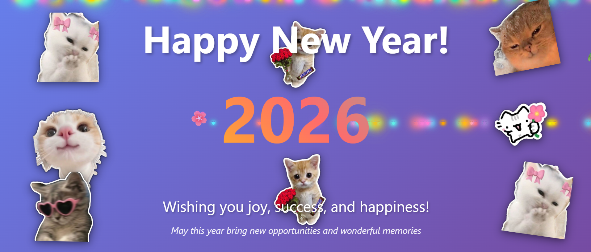

# 🎆 New Year 2026 Greeting Webpage

A fun, aesthetic, and mobile-friendly **New Year 2026 greeting webpage** created using **HTML & CSS**.
This project is perfect for sharing festive wishes with friends and family via **WhatsApp or social media**.

🔗 **Live Demo:**
👉 [https://snehasharma-9.github.io/NEW-YEAR-GREET/newyear2026.html](https://snehasharma-9.github.io/NEW-YEAR-GREET/newyear2026.html)

---

## ✨ Features

* 🎉 Festive New Year 2026 greeting
* 🐱 Cute aesthetic sticker-style visuals
* 📱 Mobile-friendly layout
* ⚡ Lightweight and fast loading
* 🌐 Hosted on **GitHub Pages**
* 🔗 Easy to share via link

---

## 🛠️ Technologies Used

* **HTML5**
* **CSS3**
* **GitHub Pages**

---

## 📸 Preview

Below is a preview of the New Year Greeting Webpage:



> 📌 *Tip:* Save your screenshot as `preview.png` in the repository root to display it here.

---

## 📂 Project Structure

```
NEW-YEAR-GREET/
│── newyear2026.html
│── preview.png
│── README.md
```

---

## 🚀 How to Use

1. Open the live webpage:

   ```
   https://snehasharma-9.github.io/NEW-YEAR-GREET/newyear2026.html
   ```
2. Share the link on WhatsApp or social media.
3. Open on any device (desktop or mobile) to view the greeting.

---

## 📌 Future Enhancements

* 🎆 Fireworks animation
* ⏳ Countdown timer
* 🎵 Background music (optional)
* 📤 WhatsApp share button
* 🌙 Dark / Light mode

---

## 👩‍💻 Author

**Sneha Sharma**

* GitHub: [https://github.com/snehasharma-9](https://github.com/snehasharma-9)
* LinkedIn: [https://www.linkedin.com/in/sneha-sharma-ab540a383/](https://www.linkedin.com/in/sneha-sharma-ab540a383/)

---

## ⭐ Support

If you liked this project, don’t forget to **star ⭐ the repository** and share it with others!
